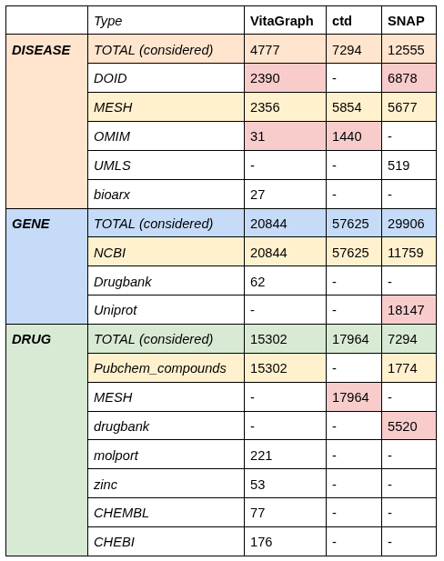
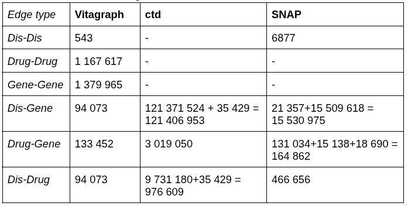

```{r setup, include=FALSE}
knitr::opts_chunk$set(echo = TRUE, cache = TRUE)
```

# Setup and datasets download

Due to the GitHub constraints about file size for some datasets, before you need
to download all the datasets.

You can download the `vitagrapgh.tsv` file at
<https://www.kaggle.com/datasets/gianlucadecarlods/vitagraph/>, 
and save it inside the directory `vitagraph`.

Download and save, inside a new directory called `CTD datasets`, these files:

| File name | Where to find it                        |
|-----------|-----------------------------------------|
| `CTD_chem_gene_ixns.tsv.gz`          | <https://ctdbase.org/downloads/#cg>     |
| `CTD_curated_chemicals_diseases.tsv.gz`          | <https://ctdbase.org/downloads/#c_cd>   |
| `CTD_chemicals_diseases.tsv.gz`          | <https://ctdbase.org/downloads/#cd>     |
| `CTD_curated_genes_diseases.tsv.gz`          | <https://ctdbase.org/downloads/#c_gd>   |
| `CTD_genes_diseases.tsv.gz`          | <https://ctdbase.org/downloads/#agg_gd> |

Download and save, inside a new directory called `SNAP datasets`, these files:

| File name | Where to find it |
|----------------------------------------|----------------------------------------|
| `ChG-InterDecagon_targets.csv.gz` | <https://snap.stanford.edu/biodata/datasets/10016/10016-ChG-InterDecagon.html> |
| `ChCh-Miner_durgbank-chem-chem.tsv.gz` | <https://snap.stanford.edu/biodata/datasets/10001/10001-ChCh-Miner.html> |
| `ChG-Miner_miner-chem-gene.tsv.gz` | <https://snap.stanford.edu/biodata/datasets/10002/10002-ChG-Miner.html> |
| `ChG-TargetDecagon_targets.csv.gz` | <https://snap.stanford.edu/biodata/datasets/10015/10015-ChG-TargetDecagon.html> |
| `DCh-Miner_miner-disease-chemical.tsv.gz` | <https://snap.stanford.edu/biodata/datasets/10004/10004-DCh-Miner.html> |
| `DG-AssocMiner_miner-disease-gene.tsv.gz` | <https://snap.stanford.edu/biodata/datasets/10012/10012-DG-AssocMiner.html> |
| `DD-Miner_miner-disease-disease.tsv.gz` | <https://snap.stanford.edu/biodata/datasets/10006/10006-DD-Miner.html> |
| `DG-Miner_miner-disease-gene.tsv.gz` | <https://snap.stanford.edu/biodata/datasets/10020/10020-DG-Miner.html> |

Setup the working directory in RStudio to the source file location, so we can use relative
path.

# Vitagraph

Is a unique file with all nodes and edges.

Load the dataset.

```{r}
vitaGRAPH <- read.table("vitagraph/vitagraph.tsv", header = TRUE)
head(vitaGRAPH)
```

Analyze the dataset.

```{r}
# Extract all the identifiers from the first and third column
identifiers <- c(vitaGRAPH[, 1], vitaGRAPH[, 3])
# Use a specific regular expression to target TYPE::IDENTIFIER
prefixes_extracted <- sub("^([^:]+::[^:]+):.*", "\\1", identifiers)
# Find the unique values of the extracted prefixes
unique_prefixes <- unique(prefixes_extracted)
length(unique_prefixes)
unique_prefixes
```

The dataset has 14 different types of node, but we will only consider the one
related to gene, drug (compound) and disease.

```{r}
valid_nodes_vitagraph <- c("Gene::NCBI","Compound::PubChem_Compounds",
                           "Compound::molport","Compound::zinc",
                           "Compound::CHEMBL","Disease::bioarx",
                           "Disease::MESH", "Compound::CHEBI",
                           "Disease::DOID","Gene::drugbank","Disease::OMIM")
```

# SNAP

In the case of SNAP and CTD the graphs are in different files, we need to
analyze the identifiers of different nodes.

Since the input data has no header, the `col.names` variable, of each SNAP dataset,
was manually defined following an analysis of the data types.

```{r}
SNAPChCh <- read.table("SNAP datasets/ChCh-Miner_durgbank-chem-chem.tsv.gz",
                       col.names = c("Drug (Drugbank)", "Drug (Drugbank)"))
head(SNAPChCh)
```

```{r}
SNAPChG_ID <- read.table("SNAP datasets/ChG-InterDecagon_targets.csv.gz", sep=",",
                         col.names = c("Drug (Pubchem)", "Gene (NCBI)"))
head(SNAPChG_ID)
```

```{r}
SNAPChG_M <- read.table("SNAP datasets/ChG-Miner_miner-chem-gene.tsv.gz",
                        col.names = c("Drug (Drugbank)", "Gene (Uniprot)"))
head(SNAPChG_M)
```

```{r}
SNAPChG_TD <- read.table("SNAP datasets/ChG-TargetDecagon_targets.csv.gz", sep=",",
                         col.names = c("Drug (Pubchem)", "Gene (NCBI)"))
head(SNAPChG_TD)
```

```{r}
SNAPDCh <- read.table("SNAP datasets/DCh-Miner_miner-disease-chemical.tsv.gz",
                      col.names = c("Disease (MESH)", "Drug (Drugbank)"))
head(SNAPDCh)
```

```{r}
SNAPDD <- read.table("SNAP datasets/DD-Miner_miner-disease-disease.tsv.gz",
                     col.names = c("Disease (DOID)", "Disease (DOID)"))
head(SNAPDD)
```

```{r}
SNAPDG_AM <- read.table("SNAP datasets/DG-AssocMiner_miner-disease-gene.tsv.gz",
                        col.names = c("Disease (UMLS)", "Disease desc.", "Gene (NCBI)"))
head(SNAPDG_AM)
```

```{r}
SNAPDG_M <- read.table("SNAP datasets/DG-Miner_miner-disease-gene.tsv.gz",
                       col.names = c("Disease (MESH)", "Gene (Uniprot)"))
head(SNAPDG_M)
```

## Counting of the number of nodes for type and identifier

To count the number of nodes of a specific type of identifier, the columns with the same header have been unified in a single vector, using `unlist()` if all the dataset is considered in the counting.

```{r}
SNAP_doids <- unique(unlist(SNAPDD))
length(SNAP_doids)
```

```{r}
SNAP_mesh <- unique(c(SNAPDG_M[[1]], SNAPDCh[[1]]))
length(SNAP_mesh)
```

```{r}
SNAP_uniprot <- unique(c(SNAPChG_M[[2]], SNAPDG_M[[2]]))
length(SNAP_uniprot)
```

```{r}
SNAP_ncbi <- unique(c(SNAPChG_ID[[2]],SNAPChG_TD[[2]],SNAPDG_AM[[3]]))
length(SNAP_ncbi)
```

```{r}
SNAP_pubchem <- unique(c(SNAPChG_ID[[1]],SNAPChG_TD[[1]]))
length(SNAP_pubchem)
```

```{r}
SNAP_db <- unique(c(SNAPChG_M[[1]],SNAPDCh[[2]], unlist(SNAPChCh)))
length(SNAP_db)
```

# CTD

```{r}
library(readr) # library to read .tsv of big size
file_path <- "CTD datasets/CTD_chem_gene_ixns.tsv.gz"

# The value of 28 is harcoded after watching carefully the .tsv file
partial_dataset <- readLines(file_path, n = 28)

header_line <- partial_dataset[28]
clean_header_line <- gsub("^#", "", header_line)
header_names <- unlist(strsplit(clean_header_line, "\t"))

CTD_CG <- read_tsv(
    file_path,
    skip = 29, 
    comment = "",
    col_names = header_names # Assign the extracted names
)

head(CTD_CG)
```

```{r}
file_path <- "CTD datasets/CTD_chemicals_diseases.tsv.gz"

# The value of 28 is harcoded after watching carefully the .tsv file
partial_dataset <- readLines(file_path, n = 28)

header_line <- partial_dataset[28]
clean_header_line <- gsub("^#", "", header_line)
header_names <- unlist(strsplit(clean_header_line, "\t"))

CTD_CD <- read_tsv(
    file_path,
    skip = 29, 
    comment = "",
    col_names = header_names
)

head(CTD_CD)
```

```{r}
file_path <- "CTD datasets/CTD_curated_chemicals_diseases.tsv.gz"

# The value of 28 is harcoded after watching carefully the .tsv file
partial_dataset <- readLines(file_path, n = 28)

header_line <- partial_dataset[28]
clean_header_line <- gsub("^#", "", header_line)
header_names <- unlist(strsplit(clean_header_line, "\t"))

CTD_CD_cur <- read_tsv(
    file_path,
    skip = 29, 
    comment = "",
    col_names = header_names
)

head(CTD_CD_cur)
```

```{r}
file_path <- "CTD datasets/CTD_genes_diseases.tsv.gz"

# The value of 28 is harcoded after watching carefully the .tsv file
partial_dataset <- readLines(file_path, n = 28)

header_line <- partial_dataset[28]
clean_header_line <- gsub("^#", "", header_line)
header_names <- unlist(strsplit(clean_header_line, "\t"))

CTD_GD <- read_tsv(
    file_path,
    skip = 29, 
    comment = "",
    col_names = header_names
)

head(CTD_GD)
```

```{r}
file_path <- "CTD datasets/CTD_curated_genes_diseases.tsv.gz"

# The value of 28 is harcoded after watching carefully the .tsv file
partial_dataset <- readLines(file_path, n = 28)

header_line <- partial_dataset[28]
clean_header_line <- gsub("^#", "", header_line)
header_names <- unlist(strsplit(clean_header_line, "\t"))

CTD_GD_cur <- read_tsv(
    file_path,
    skip = 29, 
    comment = "",
    col_names = header_names
)

head(CTD_GD_cur)
```

## Counting of the number of nodes for type and identifier

```{r}
CTD_ncbi <- unique(c(CTD_GD_cur[[2]],CTD_GD[[2]],CTD_CG[[5]]))
length(CTD_ncbi)
```

```{r}
CTD_mesh_drug <- unique(c(CTD_CG[[1]], CTD_CD[[1]],CTD_CD_cur[[1]]))
length(CTD_mesh_drug)
```

```{r}
CTD_all_disease <- c(
  as.character(CTD_CD_cur[[5]]), 
  as.character(CTD_CD[[5]]), 
  as.character(CTD_GD_cur[[4]]), 
  as.character(CTD_GD[[4]])
)
CTD_all_disease <- CTD_all_disease[!is.na(CTD_all_disease)]

CTD_mesh_disease <- CTD_all_disease[grep("^MESH:", CTD_all_disease)]
CTD_mesh_disease <- length(unique(CTD_mesh_disease))
print(paste("Total unique MESH:", CTD_mesh_disease))

CTD_omim <- CTD_all_disease[grep("^OMIM:", CTD_all_disease)]
CTD_omim <- length(unique(CTD_omim))
print(paste("Total unique OMIM:", CTD_omim))
```

# Number of nodes and genes

A problem is that nodes in the different files have different identifiers, first
we count them to understand which one were more relevant. The number
of nodes, divided by identifiers, in the different datasets van be see in Figure @ref(fig:node-table).

```{r, node-table, echo=FALSE, out.width="70%", fig.align="center", fig.cap="Number of nodes by type and identifier"}

```

The number of edges can be seen in Figure @ref(fig:edge-table).

```{r, edge-table, echo=FALSE, out.width="70%", fig.align="center", fig.cap="Number of edges"}

```

The numbers in these tables came directly from Vitagraph paper, and for ctd and
SNAP we analyze each file, counting the number of lines for edges, and the
number of unique values for columns for the number of nodes (seen in previous section).

# Find unique type of identifiers

We have established a primary identifier for each node type (highlighted in
yellow in the Figure @ref(fig:node-table)) and developed a method to convert the data in the red cells
to match this format.

## Gene - identifier: NCBI

We will ignore the few entries from drugbank.

### From Uniprot to NCBI

We will convert the ones from Uniprot using a R library (<https://bioconductor.org/packages/release/bioc/html/UniProt.ws.html>) that uses Web Services of the official site of Uniprot (<https://www.uniprot.org/>). Here an example:

```{r}
library(UniProt.ws)
mapUniProt(
   from='UniProtKB_AC-ID', 
   to='GeneID', 
   query=c('P05108','P00325')
)
```

## Disease - identifier: MESH

We will ignore the few entries from bioarx and UMLS.

### From DOID to MESH

We will use two different files as ‘map’ to try to cover more DOID possible.

One file, `doid.obo`, can be found at:
<https://raw.githubusercontent.com/DiseaseOntology/HumanDiseaseOntology/main/src/ontology/doid.obo>

Here is a snippet:

``` {}        
[Term]
id: DOID:0001816
name: angiosarcoma
alt_id: DOID:267
alt_id: DOID:4508
def: "A vascular cancer that derives_from the cells that line the walls of 
  blood vessels or lymphatic vessels." 
  [url:http\://en.wikipedia.org/wiki/Hemangiosarcoma, 
  url:https\://en.wikipedia.org/wiki/Angiosarcoma, 
  url:https\://ncit.nci.nih.gov/ncitbrowser/ConceptReport.jsp?
  dictionary=NCI_Thesaurus&ns=ncit&code=C3088, 
  url:https\://www.ncbi.nlm.nih.gov/pubmed/23327728]
subset: DO_cancer_slim
subset: NCIthesaurus
synonym: "hemangiosarcoma" EXACT []
xref: ICDO:9120/3
xref: MESH:D006394
xref: NCI:C3088
xref: NCI:C9275
xref: SNOMEDCT_US_2023_03_01:39000009
xref: UMLS_CUI:C0018923
xref: UMLS_CUI:C0854893
is_a: DOID:175 ! vascular cancer
```

By parsing the file we can search for a specific DOID and see if we can find a
correspondent MESH, in the line with format `xref: MESH:`.

Since not all DOID have a correspondent MESH, we then used a different file:
`cross_references.tsv`, that can be found at:
<https://raw.githubusercontent.com/natacourby/Disease_ontologies_for_knowledge_graphs/refs/heads/master/data/prepared_ontologies/cross_references.tsv>

``` {r}
cross_references <- read_tsv("map to MESH datasets/cross_references.tsv")
head(cross_references)
```

As we can see, searching for DOID in the 7th column, permit to find the correspondent MESH in column 2.

### From OMIM to MESH

Like for DOID, we use the same files.
In the first one searching for `xref: MIM:`, and in the second one using as index the 6th column.

## Drug - Identifier: Pubchem\_compounds

We will ignore the few entries from molport, zinc, CHEMBL, CHEBI.

### From Drugbank to Pubchem_compounds

For MESH and drugbank we will use the Pubchem APIs (<https://pubchem.ncbi.nlm.nih.gov/docs/pug-rest#section=URL-based-API>), 
parsing the xml response. 

In the base request URL: <https://pubchem.ncbi.nlm.nih.gov/rest/pug/compound/name/DBcode>,
as \texttt{DBcode} values we will use drugbank IDs for SNAP datasets, in the format \texttt{DB<number>}.

Here an example. Request: 
<https://pubchem.ncbi.nlm.nih.gov/rest/pug/compound/name/DB00829>

This is the (partial) response:

```{xml}
<PC-Compounds xmlns="http://www.ncbi.nlm.nih.gov" 
  xmlns:xs="http://www.w3.org/2001/XMLSchema-instance" 
  xs:schemaLocation="http://www.ncbi.nlm.nih.gov 
  ftp://ftp.ncbi.nlm.nih.gov/pubchem/specifications/pubchem.xsd"
>
  <PC-Compound>
    <PC-Compound_id>
        <PC-CompoundType>
          <PC-CompoundType_id>
            <PC-CompoundType_id_cid>3016</PC-CompoundType_id_cid>
          </PC-CompoundType_id>
      </PC-CompoundType>
    </PC-Compound_id>
    <PC-Compound_atoms>
    ...
    </PC-Compound_atoms>
    <PC-Compound_bonds>
    ...
    </PC-Compound_bonds>
    <PC-Compound_coords>
    ...
    </PC-Compound_coords>
    <PC-Compound_charge>0</PC-Compound_charge>
    <PC-Compound_props>
    ...
    </PC-Compound_props>
    <PC-Compound_count>
    ...
    </PC-Compound_count>
  </PC-Compound>
</PC-Compounds>
```

From which we can retrieve the `PC-CompoundType_id_cid`.

### From MESH to Pubchem_compounds

We can use also here the Pubchem APIs, but not directly with the MESH
identifier, but with the names of the chemical present in the `ChemicalName` columns seen before, in the CTD section.

Here an example. Request: 
<https://pubchem.ncbi.nlm.nih.gov/rest/pug/compound/name/1,1,1,2-tetrafluoro-2-chloroethane>

This is the (partial) response:

```{xml}
<PC-Compounds xmlns="http://www.ncbi.nlm.nih.gov" 
 xmlns:xs="http://www.w3.org/2001/XMLSchema-instance" 
 xs:schemaLocation="http://www.ncbi.nlm.nih.gov 
 ftp://ftp.ncbi.nlm.nih.gov/pubchem/specifications/pubchem.xsd"
>
  <PC-Compound>
    <PC-Compound_id>
      <PC-CompoundType>
        <PC-CompoundType_id>
          <PC-CompoundType_id_cid>17822</PC-CompoundType_id_cid>
        </PC-CompoundType_id>
      </PC-CompoundType>
    </PC-Compound_id>
    <PC-Compound_atoms>
    ...
    </PC-Compound_atoms>
    <PC-Compound_bonds>
    ...
    </PC-Compound_bonds>
    <PC-Compound_stereo>
    ...
    </PC-Compound_stereo>
    <PC-Compound_coords>
    ...
    </PC-Compound_coords>
    <PC-Compound_charge>0</PC-Compound_charge>
    <PC-Compound_props>
    ...
    </PC-Compound_props>
    <PC-Compound_count>
    ...
    </PC-Compound_count>
  </PC-Compound>
</PC-Compounds>
```

From which we can retrieve the `PC-CompoundType_id_cid`.
